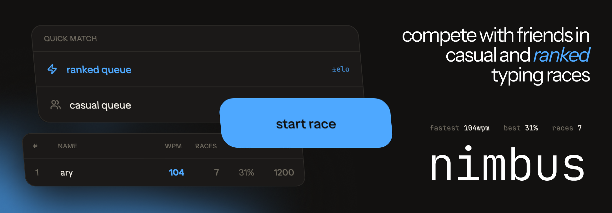
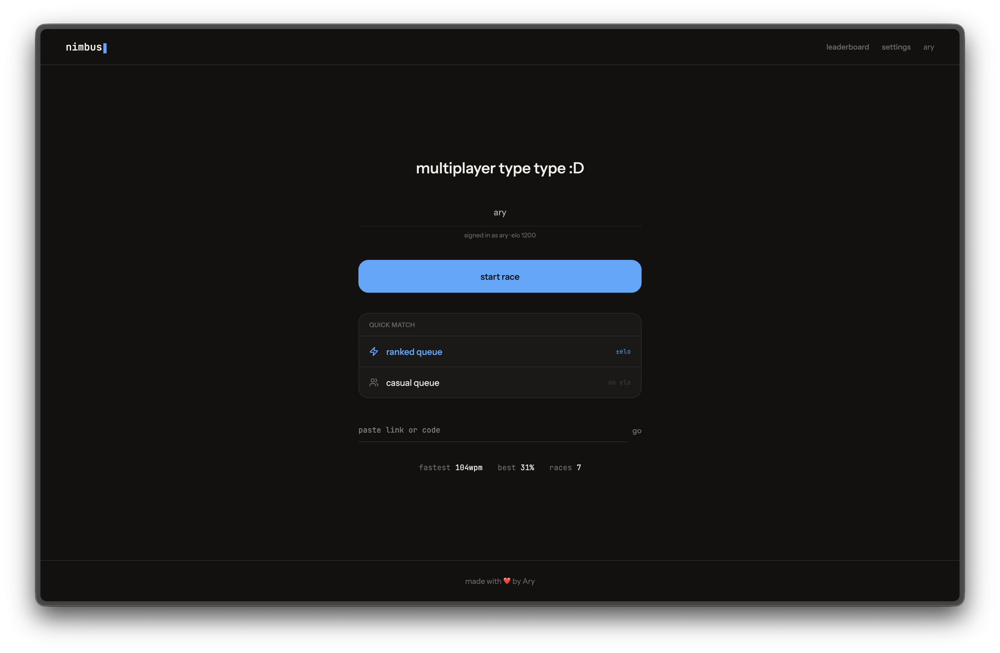
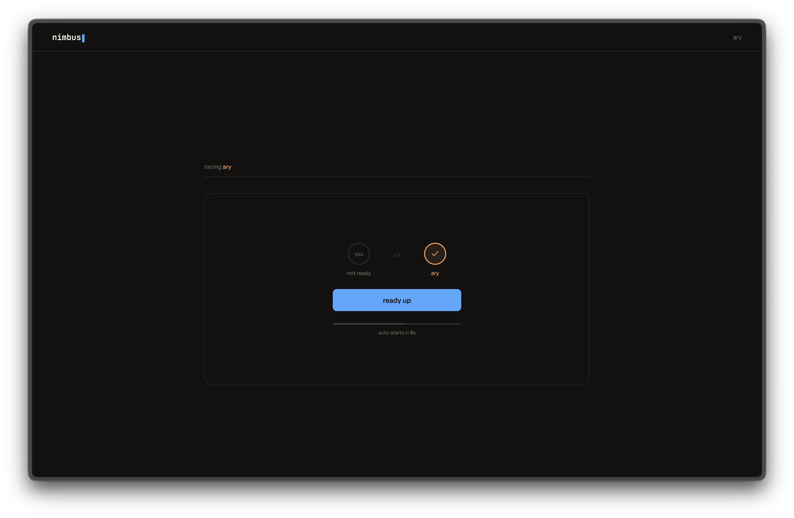
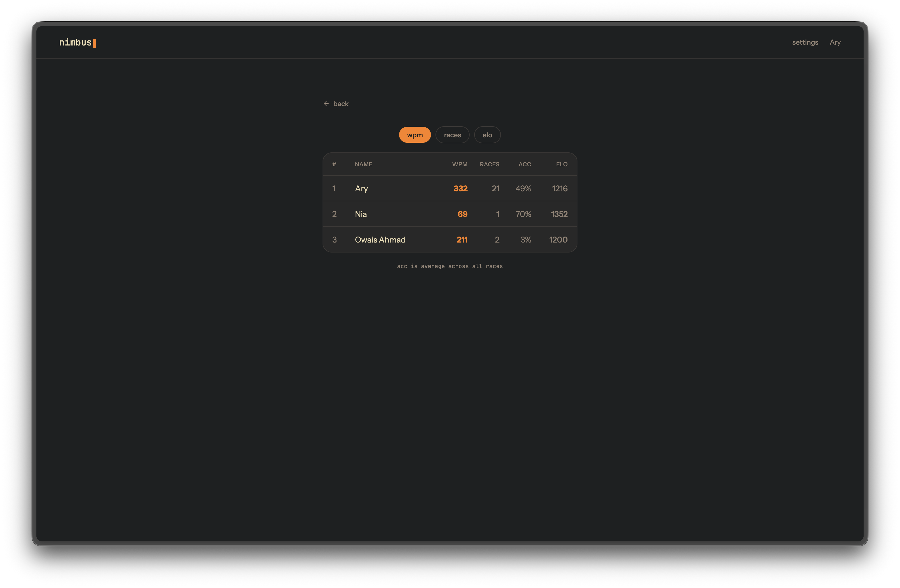
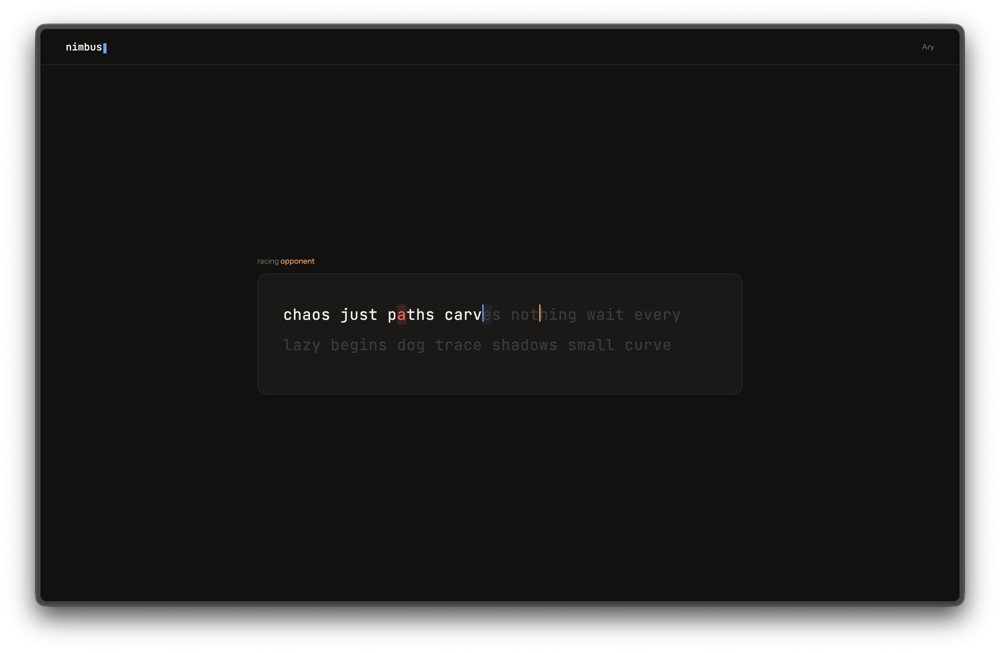

**Nimbus** is a multiplayer typing game, where you and your friends can see who types faster. You can race your friends in realtime, improve your speed, or queue ranked to gain elo and bragging points!

## Quick Match
Jump into a race with two matchmaking modes:
- Ranked | Climb the leaderboard and gain elo
- Casual | Race for fun with other people

## Private Matches
Create a room and invite your friend with a simple code or link.

## Leaderboards
Track your progress against every other player.
You can track:
- Highest WPM
- Best accuracy
- Elo
- Total races

## Races
Nimbus uses a large word bank to generate a brand new typing test each match. Words are randomly selected, giving every race a unique combination.

I implemented this to stop people from memorizing quotes, and keeping races fair for everyone.

### AI Usage
- ui iterating and css
- debugging & bug fixing
- worker

Made with ❤️ by Ary

